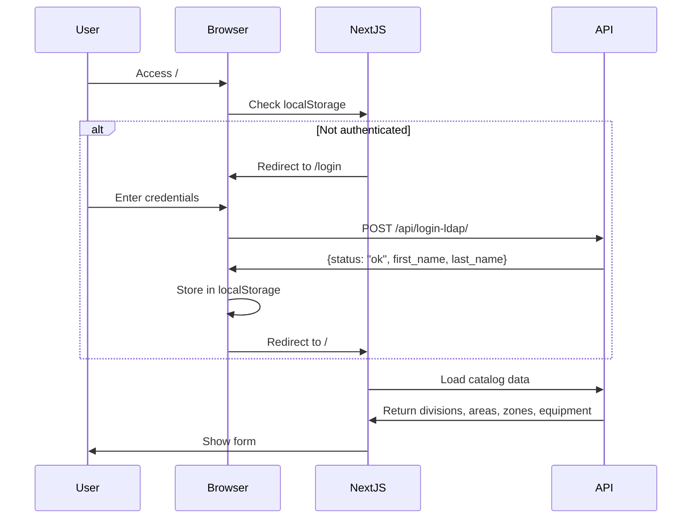

## API Configuration

The application communicates with a backend API server for all data operations.

### Base API URL

```javascript
const apiUrl = "http://10.107.194.110/insp/";
```

<Warning>
The API URL is currently hardcoded in the application. For production deployments, this should be configured via environment variables:

```javascript
const apiUrl = process.env.NEXT_PUBLIC_API_URL || "http://10.107.194.110/insp/";
```
</Warning>

## API Endpoints

The system integrates with seven main API endpoints:

### 1. Login (LDAP Authentication)

**Endpoint**: `POST /api/login-ldap/`

**Purpose**: Authenticates users against LDAP directory

**Request**:
```javascript
const response = await fetch(`${apiUrl}/api/login-ldap/`, {
  method: "POST",
  headers: {
    "Content-Type": "application/json"
  },
  body: JSON.stringify({
    username: "user123",
    password: "password"
  })
});
```

**Response** (Success):
```json
{
  "status": "ok",
  "first_name": "John",
  "last_name": "Doe"
}
```

**Response** (Failure):
```json
{
  "status": "error",
  "message": "Invalid credentials"
}
```

**Implementation**:
```javascript
const handleLogin = async (e) => {
  e.preventDefault();
  
  try {
    const response = await fetch(`${apiUrl}/api/login-ldap/`, {
      method: "POST",
      headers: { "Content-Type": "application/json" },
      body: JSON.stringify({ username, password })
    });
    
    const data = await response.json();
    
    if (data.status === "ok") {
      // Store user session
      localStorage.setItem("usuario_inspeccion", username);
      localStorage.setItem("usuario_nombre", `${data.first_name} ${data.last_name}`);
      
      // Redirect to original page or home
      const redirectUrl = localStorage.getItem("redirect_after_login") || "/";
      localStorage.removeItem("redirect_after_login");
      router.push(redirectUrl);
    } else {
      setErrorMessage("Credenciales inválidas");
    }
  } catch (error) {
    console.error(error);
    setErrorMessage("Error al iniciar sesión");
  }
};
```

### 2. Get Divisions

**Endpoint**: `GET /api/divisiones/`

**Purpose**: Retrieves list of all divisions (plantas/plants)

**Request**:
```javascript
const response = await fetch(`${apiUrl}/api/divisiones/`);
const divisiones = await response.json();
```

**Response**:
```json
[
  {
    "id": 1,
    "nombre": "Planta Norte"
  },
  {
    "id": 2,
    "nombre": "Planta Sur"
  }
]
```

### 3. Get Areas

**Endpoint**: `GET /api/areas/`

**Purpose**: Retrieves list of all operational areas

**Request**:
```javascript
const response = await fetch(`${apiUrl}/api/areas/`);
const areas = await response.json();
```

**Response**:
```json
[
  {
    "id": 1,
    "nombre": "Producción"
  },
  {
    "id": 2,
    "nombre": "Mantenimiento"
  }
]
```

### 4. Get Zones

**Endpoint**: `GET /api/zonas/`

**Purpose**: Retrieves list of all zones within areas

**Request**:
```javascript
const response = await fetch(`${apiUrl}/api/zonas/`);
const zonas = await response.json();
```

**Response**:
```json
[
  {
    "id": 1,
    "nombre": "Zona A"
  },
  {
    "id": 2,
    "nombre": "Zona B"
  }
]
```

### 5. Get Equipment

**Endpoint**: `GET /api/equipos/`

**Purpose**: Retrieves list of all equipment/machinery

**Request**:
```javascript
const response = await fetch(`${apiUrl}/api/equipos/`);
const equipos = await response.json();
```

**Response**:
```json
[
  {
    "id": 1,
    "nombre": "Compresor #1",
    "division_id": 1,
    "area_id": 2,
    "zona_id": 1,
    "ubicacion": "Edificio A, Nivel 2",
    "categoria": "COMPRESOR"
  },
  {
    "id": 2,
    "nombre": "Bomba Hidráulica #3",
    "division_id": 1,
    "area_id": 2,
    "zona_id": 2,
    "ubicacion": "Edificio B, Nivel 1",
    "categoria": "BOMBA"
  }
]
```

<Info>
Equipment objects include hierarchical relationships (division, area, zone) and additional metadata (location, category).
</Info>

**Finding Specific Equipment**:
```javascript
const equipoId = searchParams.get("equipo");

if (equipoId) {
  fetch(`${apiUrl}/api/equipos/`)
    .then(res => res.json())
    .then(equipos => {
      const equipo = equipos.find(e => String(e.id) === String(equipoId));
      
      if (equipo) {
        // Populate form with equipment details
        setFormData(prev => ({
          ...prev,
          division: equipo.division_id,
          area: equipo.area_id,
          zona: equipo.zona_id
        }));
        
        setUbicacion(equipo.ubicacion);
        setCategoria(equipo.categoria);
        
        // Load inspection questions for this category
        if (equipo.categoria) {
          fetch(`${apiUrl}/api/preguntas/${equipo.categoria}/`)
            .then(res => res.json())
            .then(setPreguntas)
            .catch(err => console.error("Error cargando preguntas", err));
        }
      }
    })
    .catch(err => console.error("Error cargando equipo", err));
}
```

### 6. Get Questions by Category

**Endpoint**: `GET /api/preguntas/{categoria}/`

**Purpose**: Retrieves inspection questions for a specific equipment category

**Request**:
```javascript
const categoria = "COMPRESOR";
const response = await fetch(`${apiUrl}/api/preguntas/${categoria}/`);
const preguntas = await response.json();
```

**Response**:
```json
[
  {
    "id": 1,
    "descripcion": "Verificar nivel de aceite",
    "categoria": "COMPRESOR",
    "orden": 1
  },
  {
    "id": 2,
    "descripcion": "Inspeccionar fugas de aire",
    "categoria": "COMPRESOR",
    "orden": 2
  },
  {
    "id": 3,
    "descripcion": "Revisar presión de operación",
    "categoria": "COMPRESOR",
    "orden": 3
  }
]
```

### 7. Submit Inspection Form

**Endpoint**: `POST /api/guardar/`

**Purpose**: Saves completed inspection form data

**Request**:
```javascript
const handleSubmit = async (e) => {
  e.preventDefault();
  
  if (!apiUrl) return;
  
  // Calculate end time
  const horaFin = new Date().toTimeString().split(" ")[0];
  
  // Prepare submission data
  const submissionData = {
    ...formData,
    horaFin: horaFin,
    usuario: usuario
  };
  
  try {
    const response = await fetch(`${apiUrl}/api/guardar/`, {
      method: "POST",
      headers: {
        "Content-Type": "application/json"
      },
      body: JSON.stringify(submissionData)
    });
    
    const result = await response.json();
    
    setStatusMessage(result.message || "Formulario enviado correctamente");
    
    // Reset form
    setFormData({
      fecha: "",
      horaInicio: "",
      horaFin: "",
      division: "",
      area: "",
      zona: "",
      equipo: "",
      observaciones: "",
      tecnicos: {}
    });
    
    setCategoria("");
    setUbicacion("");
    setPreguntas([]);
  } catch (error) {
    console.error(error);
    setStatusMessage("Error al enviar");
  }
};
```

**Request Body**:
```json
{
  "fecha": "2026-03-06",
  "horaInicio": "09:30:00",
  "horaFin": "10:15:00",
  "division": "1",
  "area": "2",
  "zona": "1",
  "equipo": "1",
  "observaciones": "Equipo operando normalmente. Se detectó ligera vibración.",
  "tecnicos": {
    "Verificar nivel de aceite": "OK",
    "Inspeccionar fugas de aire": "OK",
    "Revisar presión de operación": "NOK",
    "Limpiar filtros": "OK",
    "Verificar conexiones eléctricas": "NA"
  },
  "usuario": "Juan Pérez"
}
```

**Response** (Success):
```json
{
  "status": "success",
  "message": "Formulario enviado correctamente",
  "id": 12345
}
```

## Parallel Data Loading

The application uses `Promise.all()` for efficient parallel loading of catalog data:

```javascript
useEffect(() => {
  if (!apiUrl) return;
  
  // Initialize date and time
  const now = new Date();
  const timeString = now.toTimeString().split(" ")[0];
  
  setFormData(prev => ({
    ...prev,
    fecha: now.toISOString().split("T")[0],
    horaInicio: timeString
  }));
  
  // Load all catalogs in parallel
  Promise.all([
    fetch(`${apiUrl}/api/divisiones/`).then(r => r.json()).catch(() => []),
    fetch(`${apiUrl}/api/areas/`).then(r => r.json()).catch(() => []),
    fetch(`${apiUrl}/api/zonas/`).then(r => r.json()).catch(() => []),
    fetch(`${apiUrl}/api/equipos/`).then(r => r.json()).catch(() => [])
  ]).then(([divisiones, areas, zonas, equipos]) => {
    setDivisiones(divisiones);
    setAreas(areas);
    setZonas(zonas);
    setEquipos(equipos);
  });
}, [apiUrl]);
```

<Note>
Parallel loading reduces initial load time by fetching all catalog data simultaneously rather than sequentially.
</Note>

## Error Handling

The application implements consistent error handling patterns:

### Fetch Error Handling

```javascript
// Pattern 1: Catch and return empty array
fetch(`${apiUrl}/api/divisiones/`)
  .then(r => r.json())
  .catch(() => [])

// Pattern 2: Catch and log error
fetch(`${apiUrl}/api/preguntas/${categoria}/`)
  .then(r => r.json())
  .then(setPreguntas)
  .catch(err => console.error("Error cargando preguntas", err))

// Pattern 3: Try-catch with user feedback
try {
  const response = await fetch(`${apiUrl}/api/guardar/`, { ... });
  const result = await response.json();
  setStatusMessage(result.message || "Formulario enviado correctamente");
} catch (error) {
  console.error(error);
  setStatusMessage("Error al enviar");
}
```

<Warning>
Current error handling silently fails for catalog loading. Consider implementing user notifications for failed data loads.
</Warning>

## CORS Configuration

For the API to work correctly from the Next.js frontend, the backend must support CORS:

```python
# Example Django CORS configuration
CORS_ALLOWED_ORIGINS = [
    "http://localhost:3000",
    "http://10.107.194.110",
]

CORS_ALLOW_METHODS = ["GET", "POST", "OPTIONS"]
CORS_ALLOW_HEADERS = ["Content-Type"]
```

## Authentication Flow



## API Response Caching

<Info>
Currently, there is no response caching implemented. Consider adding:
- Browser cache headers for catalog data
- React Query or SWR for automatic caching and revalidation
- Service Worker for offline support
</Info>

## Testing API Integration

Example curl commands for testing endpoints:

```bash
# Test login
curl -X POST http://10.107.194.110/insp/api/login-ldap/ \
  -H "Content-Type: application/json" \
  -d '{"username":"testuser","password":"testpass"}'

# Get divisions
curl http://10.107.194.110/insp/api/divisiones/

# Get equipment
curl http://10.107.194.110/insp/api/equipos/

# Get questions for category
curl http://10.107.194.110/insp/api/preguntas/COMPRESOR/

# Submit inspection
curl -X POST http://10.107.194.110/insp/api/guardar/ \
  -H "Content-Type: application/json" \
  -d @inspection-data.json
```